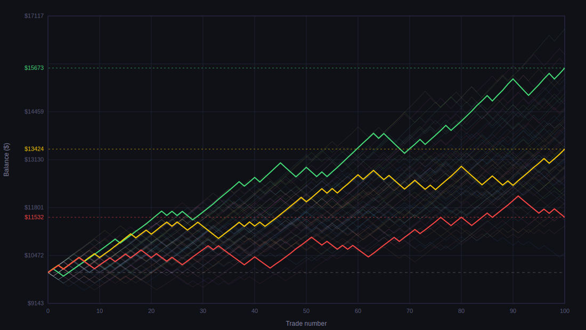

# mcsim

Monte Carlo simulator for trading systems. Runs thousands of simulations based on your strategy parameters and shows you the range of possible outcomes.



## Install

Download the latest binary from [Releases](https://github.com/danxxxr/mcsim/releases) or build from source:

```
git clone https://github.com/danxxxr/mcsim
cd mcsim
go build .
```

## Usage

```
./mcsim
```

On first run, `mcsim.ini` is created with default values. Edit it and run again.

```
./mcsim -win-rate 0.65 -rr 1.5 -sims 5000
./mcsim -config my.ini
./mcsim -no-save
./mcsim -save-all -output ./results
./mcsim -version
./mcsim -help
```

## Flags

| Flag | Short | Description |
|------|-------|-------------|
| `-config` | | Path to config file (default: `mcsim.ini`) |
| `-balance` | `-b` | Initial balance |
| `-win-rate` | `-w` | Win rate (0.65 = 65%) |
| `-breakeven` | `-be` | Breakeven trades rate (0.05 = 5%) |
| `-rr` | | Reward:risk ratio (1.5 = 1.5:1) |
| `-risk` | `-r` | Risk per trade (0.01 = 1%) |
| `-trades` | `-t` | Number of trades |
| `-sims` | `-s` | Number of simulations |
| `-commission` | | Broker commission (0.01 = 1%) |
| `-compounding` | | Use compounding |
| `-rr-model` | | RR model: `fixed`, `uniform`, `normal` |
| `-rr-deviation` | | Deviation for uniform model (0.1 = ±10%) |
| `-rr-sigma` | | Std deviation for normal model (0.1 = 10%) |
| `-save-report` | `-sr` | Save text report |
| `-save-csv` | `-sc` | Save CSV file |
| `-save-svg` | `-ss` | Save SVG chart |
| `-svg-max-curves` | | Maximum curves on SVG chart |
| `-no-save` | `-n` | Output to console only, save nothing |
| `-save-all` | `-sa` | Save report, CSV and SVG |
| `-output` | `-o` | Output directory |
| `-version` | | Show version |
| `-help` | | Show help |

## Config

`mcsim.ini` is created automatically on first run. All flags override config values.

```ini
[simulation]
initial_balance = 10000
win_rate = 0.65
breakeven_percent = 0.0
win_multiplier = 1.0
risk_percent = 0.01
trade_count = 100
simulation_count = 1000
commission = 0.0
use_compounding = true
rr_model = fixed
rr_deviation = 0.1
rr_sigma = 0.1

[output]
save_report = true
save_csv = true
save_svg = true
svg_max_curves = 60
output_dir = .
```

## Output

| File | Description |
|------|-------------|
| `monte_carlo_report_<timestamp>.txt` | Full statistics report |
| `monte_carlo_results_<timestamp>.csv` | Raw simulation data |
| `monte_carlo_results_<timestamp>.svg` | Equity curves chart |

## License

MIT
